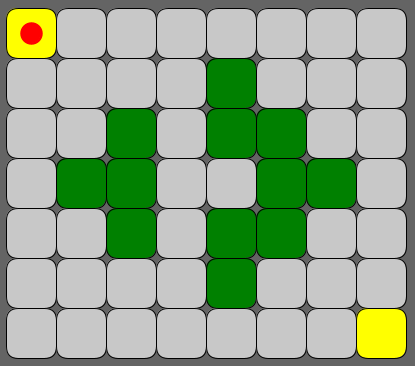
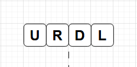
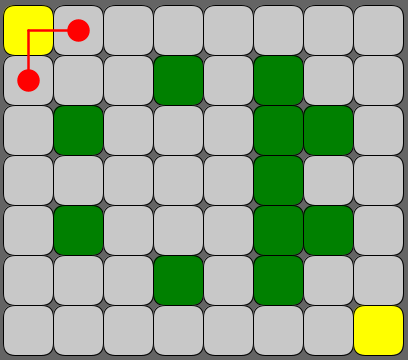
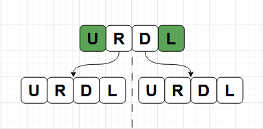
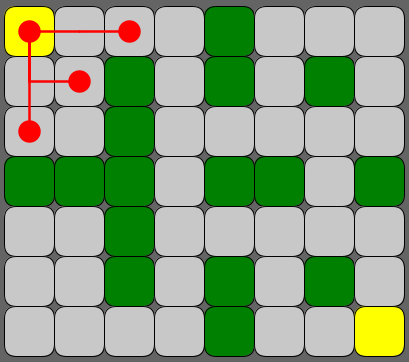
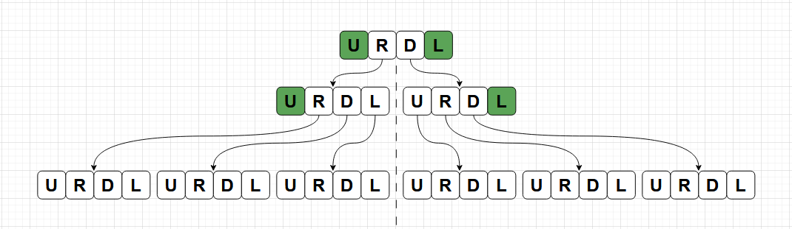

# Maze Challenge

Solução para o Desafio do Labirinto Autômato Stone.

## Pontos que levei em consideração para resolver o desafio

- Entender bem o problema proposto
- Modelagem com classes, estrutura de dados e diagramas
- Ter um jeito de visualizar a execução do programa ao longo do tempo
- Ter testes automatizados para possibilitar produtividade e refatoração
- Deixar o código genérico, a ponto de aceitar diferentes inputs e regras de propagação

## Como rodar o projeto?

- Instale a JDK 11 ou superior
- Escolha o GameMode
- Dentro do GameMode escolhido, escolhar o MazeOption
- Inicie o programa

## Chutes pra fase 2

- Labirinto gigante
- Células inicial e final fora dos cantos do labirinto
- Player pode se mover nas diagonais tbm
- Células inicial e final (ou só a final) mudam de lugar a cada geração

## Entendendo, visualizando e resolvendo o problema

Segue o primeiro labirinto do desafio:

Ele possui 7 linhas e 8 colunas, seguindo o modelo de propagação:

- As células brancas com 2 ou 3 vizinhos viram verdes.
- As células verdes com 4 ou 5 ou 6 vizinhos permanecem verdes. Do contrário, viram brancas.

Podemos representar os caminhos possíveis no labirinto utilizando uma árvore, onde:

- Cada nó da árvore está associado a uma única célula no labirinto.
- Cada célula do labirinto pode estar associada a mais de um nó da árvore.

Para exemplificar, o estado inicial do labirinto leva à seguinte árvore:

Na geração seguinte (nível 01), temos que:

E na próxima (nível 02):

Perceba que temos um padrão aqui:

`Iniciando em uma célula qualquer do labirinto, cada alteração de estado do automato gera um novo nível na árvore de caminhos.`

Isso escala rapidamente, mesmo para labirintos pequenos, pois para cada direção (U, R, D, L) possível, são gerados mais 4 direções.

No caso máximo, temos: 4 -> 16 -> 64 -> 256 -> 1.024 -> 4.096 -> 16.384 -> 65.536 -> 262.144 -> 1.048.576 ...

Podemos montar uma rotina para resolver o problema da seguinte forma:

- 0 ➡️ Carregue o estado inicial do labirinto e da árvore;
- 1 ➡️ Itere sobre os nós do nível atual da árvore, filtrando um nó para cada célula mais à direita e mais à baixo do labirinto;
- 2 ➡️ Itere sobre os nós filtrados, expandindo cada um para formar o próximo nível da árvore;
- 3 ➡️ Se algum nó expandido for o nó objetivo (última célula do labirinto), encerre a busca;
- 4 ➡️ Caso contrário, transicione o labirinto para o próximo estado e volte para o passo 1;

Perceba que o filtro do passo 1 é feito pegando os nós da "fronteira", ou seja, mais a direita e mais abaixo no labirinto.

Para otimizar esse processo de filtrar os nós do nível atual, fiz o seguinte:

- Os nós do nível foram armazenados em um HashMap, onde a chave é um inteiro e o valor, um nó.
- Essa chave corresponde ao id do nó. Cada nó possui um id pré-definido, com base na linha e na coluna da célula correspondente.
- Assim, conseguimos inserir e buscar um nó do HashMap em tempo constante.
- Já os nós filtrados são armazenados em um HashSet, onde podemos verificar se um nó já foi filtrado antes também em tempo constante.
- Um ponto interessante aqui é que o próprio HashMap já pode filtrar os nós expandidos que já estiverem dentro dele, pois não permite duplicações de chave.

Após o filtro, iteramos sobre os nós filtrados do HashSet, expandindo cada um e formando o novo nível da árvore.
