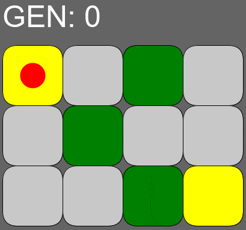

# Maze Challenge

Solução para o Desafio do Labirinto Autômato Stone.

é ç ã ú á õ ó í

## Visualizando o problema

O labirinto a seguir está em seu estado inicial. Ele possui 3 linhas e 4 colunas.

O número em cada célula representa a quantidade de vizinhos verdes dela.

Ele segue o modelo de propagação:

    - As células brancas com 2 ou 3 vizinhos viram verdes.
    - As células verdes com 4 ou 5 vizinhos permanecem verdes. Do contrário, viram brancas.

A seguir temos a evolução do labirinto para as 3 primeiras gerações:

Podemos representar os caminhos válidos no labirinto utilizando uma árvore:

    - Cada nó da árvore está associado a uma única célula no labirinto.
    - Cada célula do labirinto pode estar associada a mais de um nó da árvore.

Assim, a ideia principal da solução é:

`Iniciando em uma célula qualquer do labirinto, cada alteração de estado do automato gera um novo nível na árvore de caminhos.`

Isso escala rapidamente, mesmo para labirintos pequenos, pois para cada direcao (U, R, D, L) possivel, sao gerados mais 4 direcoes.

No caso maximo, temos: 4 -> 16 -> 64 -> 256 -> 1.024 -> 4.096 -> 16.384 -> 65.536 -> 262.144 -> 1.048.576 -> 4.194.304

Para o Labirinto acima, eh possivel determinar todas as solucoes:

---

## Pontos que levei em consideracao para resolver o desafio

- Entender bem o problema proposto
- Modelagem com classes, estrutura de dados e diagramas
- Ter um jeito de visualizar a execucao do programa ao longo do tempo
- Ter testes automatizados para possibilitar produtividade e refatoracao
- Deixar o codigo generico, a ponto de aceitar diferentes inputs e regras de propagacao

## Como rodar o projeto?

- Instale o Processing?
- Instale a JDK na versao tal?

- Escolha o GameMode
- Escolhar o MazeOption
-

## Chutes pra fase 2

- Labirinto gigante
- Células inicial e final fora dos cantos do labirinto
- Player pode se mover nas diagonais tbm
- Células inicial e final (ou só a final) mudam de lugar a cada geração

## Melhorias

- Desenhar todos os caminhos se propagando no Labirinto
- Desenhar ao mesmo tempo a Arvore sendo criada
