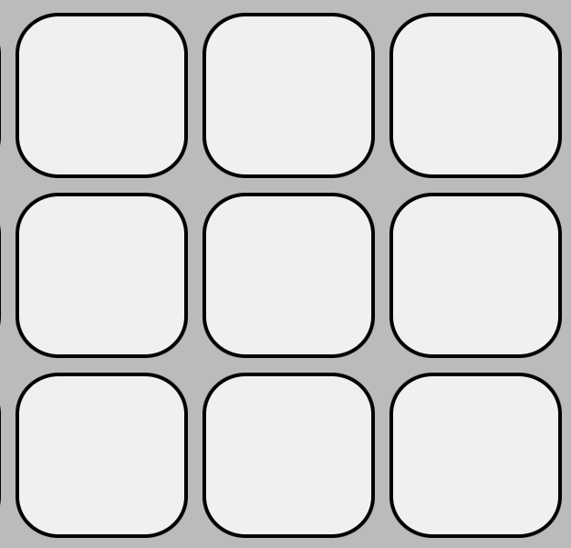

# Desafio do Labirinto Autômato Stone

Você terá que transitar por um autômato cuja matriz possui 65 linhas e 85 colunas, conforme mostra a figura abaixo.

Como seria praticamente impossível resolver na mão, você deverá atacar este problema usando algoritmos e códigos de programação.

Para esta fase, o modelo de propagação é o seguinte:

- As células brancas transformam-se em verdes, se possuírem número de células adjacentes verdes maior do que 1 e menor do que 5. Do contrário, permanecem brancas.

- As células verdes permanecem verdes se possuírem número de células adjacentes verdes maior do que 3 e menor do que 6. Do contrário, transformam-se em brancas.

Duas células são consideradas adjacentes se possuem uma fronteira, seja na lateral, acima, abaixo ou diagonalmente. No exemplo abaixo, a célula branca no centro possui, portanto, 8 células brancas adjacentes.

A configuração inicial da matriz, ou seja, a cor de cada célula no início está representada em um arquivo que você deverá baixar, que tem as seguintes características:

Um arquivo de texto codificado no formato UTF-8

O arquivo de texto contém 65 linhas. Cada linha contém 85 valores inteiros separados por um espaço em branco seguidos por um caractere de nova linha "\n".

Esses valores representam os estados das células de uma matriz com 65 linhas e 85 colunas.

O valor "3" representa o ponto de partida, o valor "4" representa o ponto de destino. O valor "0" representa uma célula branca e o valor "1" uma célula verde.

Cada linha do arquivo representa uma linha da matriz e cada valor da linha o valor de uma célula nessa linha. O primeiro valor do arquivo representa o canto superior esquerdo da matriz.

## SUBMISSÃO DA SOLUÇÃO

Você deverá submeter um arquivo de texto com uma única linha contendo todos os movimentos da partícula, saindo do ponto inicial até atingir o ponto de destino.

Cada movimento deve ser separado por um espaço em branco. Cada letra representa um passo da partícula e, consequentemente, uma atualização do tabuleiro.

    U - movimento para cima
    D - movimento para baixo
    R - movimento para direita
    L - movimento para esquerda

A partícula inicia seu movimento no estado atual e finaliza seu movimento após a atualização do tabuleiro. A partícula nunca deve finalizar seu movimento em uma célula verde.

Exemplo de resposta hipotética com 10 movimentos: R R D R D L U D R R

## CÓDIGO FONTE

Você deverá submeter também seu código fonte ou modelo utilizado para encontrar a resposta.
